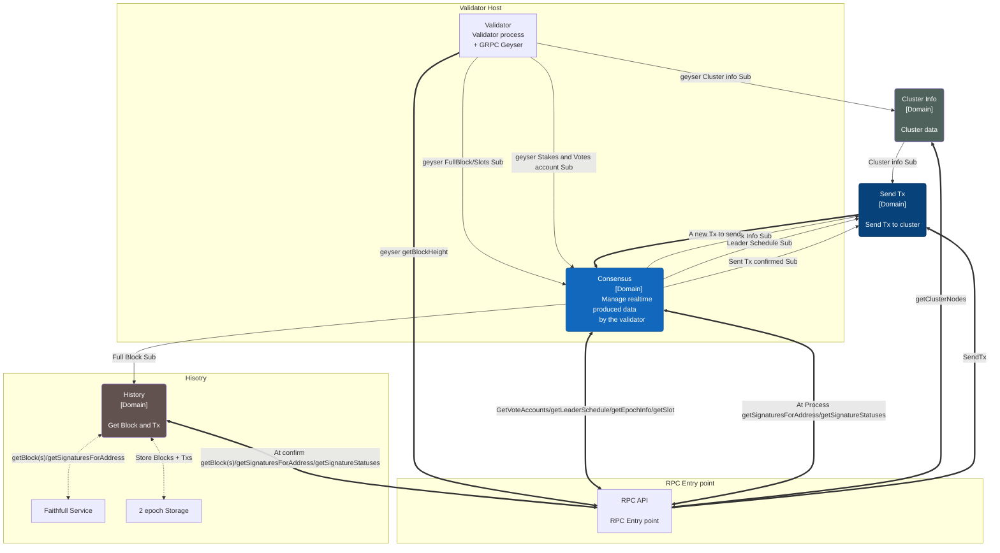
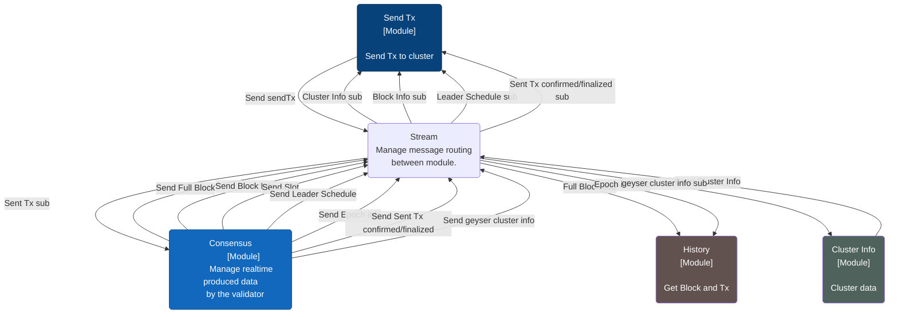

# Architecture

## Modules

### Consensus
Manage real time generated data by the validator.

Implements these calls:
 * GetVoteAccounts
 * getLeaderSchedule
 * getEpochInfo
 * getSlot
 * getSignatureStatuses at process commitment.
 * new tx sent: call by the SendTx module when a Tx is processed by sendTx module.

Provide these subscription:
 * Full block
 * BLock info
 * Slots
 * Leader schedule
 * sent Tx at confirmed and / or finalized: notify when a Tx sent is confirmed or finalized. 

A new subscription is added: Sent Tx confirmed/ finalized. SendTx module send Tx signature to the consensus module and when a Tx sent is confirmed (or finalized), it is notified on this subscription.

It avoids to call getSignatureStatuses in a pull mode.

### SendTx
Manage the whole send Tx process. Represent the current Lite RPC process.

Implements the sendTx call.

### History
Manage history function like getBlocks.

A special use case is the getSignatureStatuses because on process its the Consensus module that provide tha data.

### Cluster
Manage cluster information.

Implement the call: getClusterNodes

Provide the subscription: cluster info.

### RPC
It's an entry point for all call and dispatch the call to the right function.

## Interaction diagram

## Message stream
Module organization can change depending on the deployment needed. For example several validator node can be started to add reliability. To ease this association between module and server installation, module communication will be done mostly via asynchronous message. This message propagation and routing will done by the Stream module.

Module register to it to get notifified and send new message to specific entry point.

The logic organization will be.

## Bootstrap architecture
To be done

## Deployment example

```mermaid
flowchart TD
    SendTx1("Send Tx Host")
    SendTx2("Send Tx Host")
    subgraph Data_instance1
        History1("History + bootstrap")
        Cluster1("Cluster Info")
    end
    subgraph Data_instance2
        History2("History + bootstrap")
        Cluster2("Cluster Info")
    end
    subgraph Data_instance3
        History3("History + bootstrap")
        Cluster3("Cluster Info")
    end

    subgraph Validator1_Host
        Validator1["Validator"]
        Consensus1("Consensus + bootstrap")
    end
    subgraph Validator2_Host
        Validator2["Validator"]
        Consensus2("Consensus + bootstrap")
    end

    RPC["RPC entry point
        dispatch on started servers"]

    Stream("Stream")

    RPC== "Send sendTx" ==>SendTx1
    RPC== "Send sendTx" ==>SendTx2
    SendTx1-- "Send Tx send" -->Stream
    SendTx2-- "Send Tx send" -->Stream
    Stream-- "Block Info" -->SendTx1
    Stream-- "Block Info" -->SendTx2

    Consensus1-- "Send consensus data" -->Stream
    Consensus2-- "Send consensus data" -->Stream
    RPC== "Send sendTx" ==>Consensus1
    RPC== "Send sendTx" ==>Consensus2

    History1-- "Block sub" -->Stream
    History2-- "Block sub" -->Stream
    History3-- "Block sub" -->Stream
    RPC<== "getBlock" ==>History1
    RPC<== "getBlock" ==>History2
    RPC<== "getBlock" ==>History3

    Cluster1-- "Block sub" -->Stream
    Cluster2-- "Block sub" -->Stream
    Cluster3-- "Block sub" -->Stream
    RPC<== "getClusterNodes" ==>Cluster1
    RPC<== "getClusterNodes" ==>Cluster2
    RPC<== "getClusterNodes" ==>Cluster3

    classDef consensus fill:#1168bd,stroke:#0b4884,color:#ffffff
    classDef history fill:#666,stroke:#0b4884,color:#ffffff
    classDef sendtx fill:#08427b,stroke:#052e56,color:#ffffff
    classDef redgray fill:#62524F, color:#fff
    classDef greengray fill:#4F625B, color:#fff

    class SendTx1 sendtx
    class SendTx2 sendtx
    class Data_instance1 redgray
    class Data_instance2 redgray
    class Data_instance3 redgray
    class Validator1_Host consensus
    class Validator2_Host consensus
    class Cluster greengray
```

