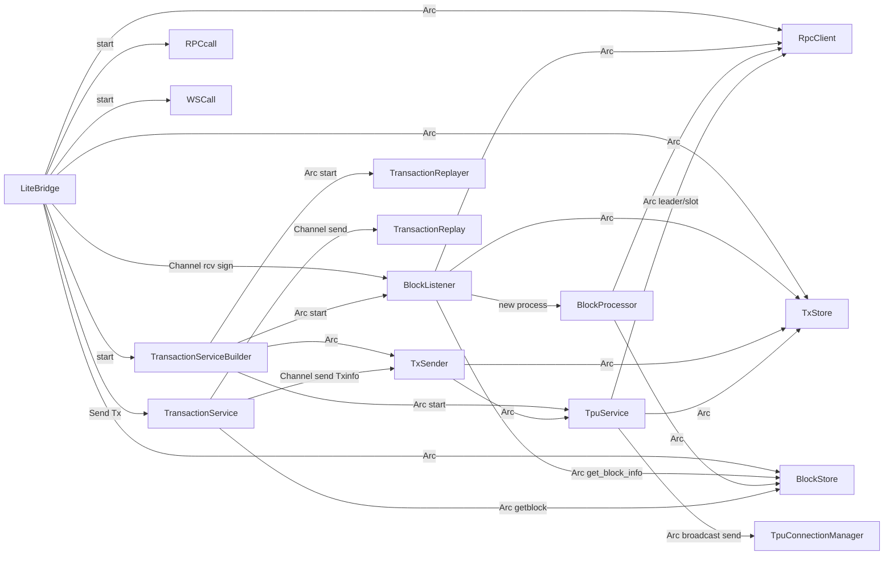

# Lite-RPC Modules

## Dependencies diagram

```mermaid
flowchart LR
    LiteBridge-->|Arc| RpcClient
    LiteBridge-->|Arc| TxStore
    LiteBridge-->|Arc| BlockStore
    LiteBridge-->|Channel rcv sign| BlockListener
    LiteBridge-->|start| TransactionServiceBuilder
    LiteBridge-->|start| RPCcall
    LiteBridge-->|start| WSCall
    LiteBridge-->|Send Tx| TransactionService
    
    TransactionServiceBuilder-->|Arc| TxSender
    TransactionServiceBuilder-->|Arc start| TransactionReplayer
    TransactionServiceBuilder-->|Arc start| BlockListener
    TransactionServiceBuilder-->|Arc start| TpuService
    
    BlockListener-->|Arc| TxStore
    BlockListener-->|Arc| RpcClient
    BlockListener-->|new process| BlockProcessor
    BlockListener-->|Arc get_block_info| BlockStore
    
    BlockProcessor-->|Arc| BlockStore
    BlockProcessor-->|Arc| RpcClient
    
    TransactionService-->|Channel send| TransactionReplay
    TransactionService-->|Channel send Txinfo| TxSender
    TransactionService-->|Arc getblock| BlockStore
    
    TxSender-->|Arc| TxStore
    TxSender-->|Arc| TpuService
    
    TpuService-->|Arc leader/slot| RpcClient
    TpuService-->|Arc| TxStore
    TpuService-->|Arc broadcast send| TpuConnectionManager
    
    
    
    
    
```

