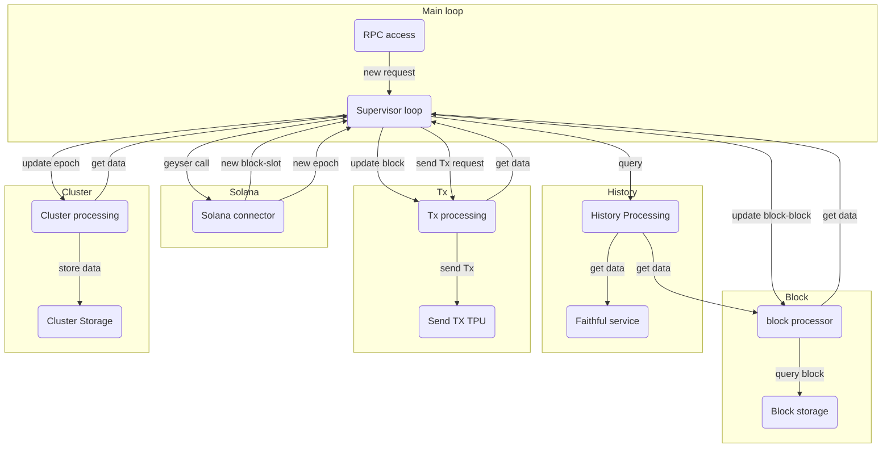
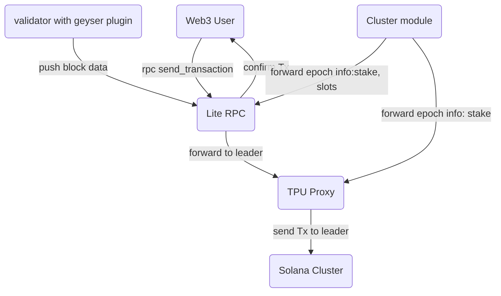
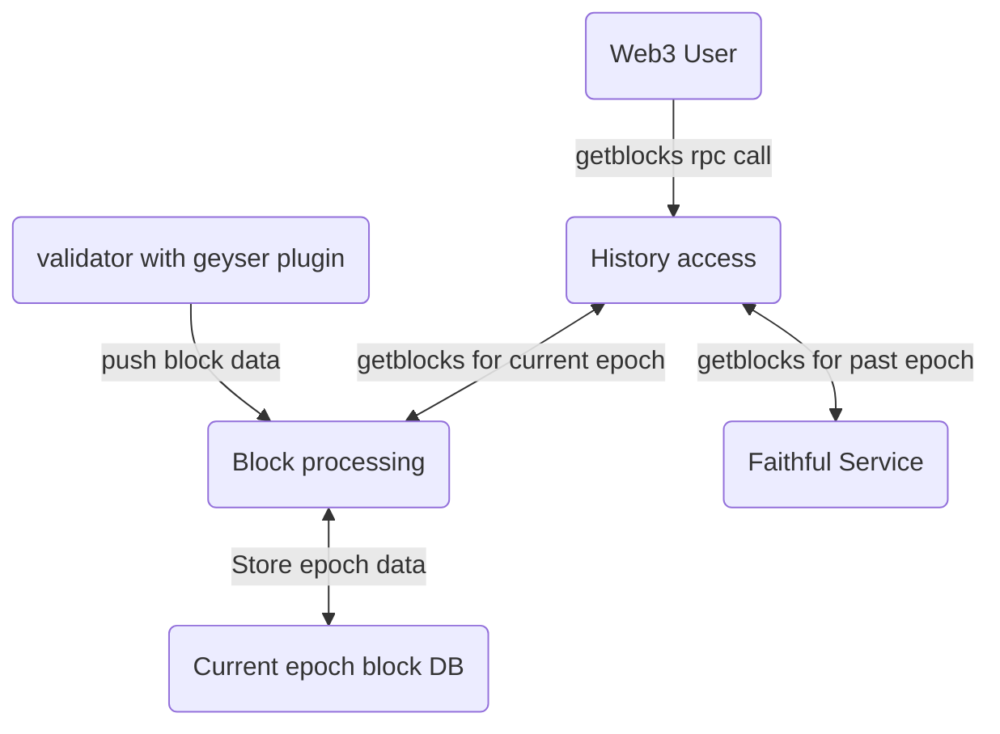
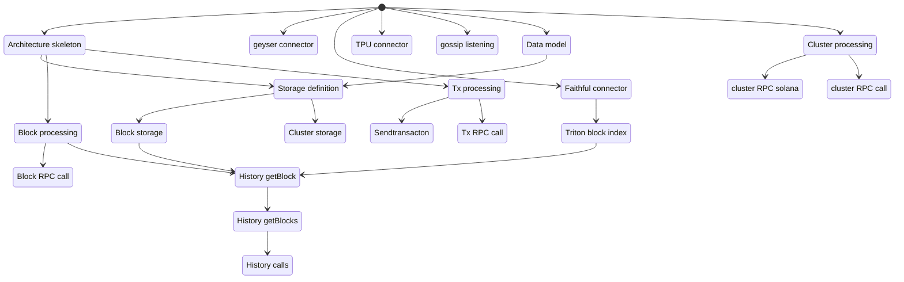

# RPC Service

## Definitions

*RPC service*: a service accessible from the network that propose Solana RPC API call.

*Validator*: a node that run Solana protocol and validate blocks.

*RPC node*: define all the components, servers needed to provide a RPC service.

*Tx*: a Solana transaction.

*SC*: Smart contract

## Requirement / Context

This specification is done based on these prerequisite:

 * The RPC operator has access to a trusted validator.
 * The RPC user trust the RPC service. This assumption will be removed when the [SIMD-0052](https://github.com/solana-foundation/solana-improvement-documents/pull/52) will be implemented.
 * The validator don't have any RPC service. Only the geyser plugin push subscription can be use to get validator data.

## Needs definition

### Personas

*Solana*: Developer of the code that run Solana blockchain.

*RPC operator*: Run a RPC service (Triton).

*RPC user*: Use the RPC service (Mango).

*Developer*: Rust developer of an application that access the RPC service.

### User stories

0) As a <>, I want to ... so that ...

1) As *Solana*, I want to remove the RPC service from the validator so that the RPC processing doesn't use CPU/Memory load on the validator.
2) As a *RPC operator*, I want to be able to start a RPC service in my infra so that I can propose the service a any moment.
3) As a *RPC operator*, I want to restart the service after a crash so that I can be productive fast.
4) As a *RPC operator*, I want the RPC service to be reliable so that I can propose it in my service. (Common availability solution can be apply to the service)
5) As a *RPC user*,  I want to send a Tx and get a confirmation so that I know when the Tx has been processed.
6) As a *RPC user*,  I want to get my Tx history so that I can know all my account Tx.
7) As a *RPC user*,  I want to see log event with low latency so that I'm informed of unusual SC use or SC error.
8) As a *RPC user*,  I want to get log event of an SC in the past so that I can study my SC activity.
9) As a *Developer*, I want to use a Rust SDK that hide internal detail on how to access the RPC service so that it's easier to develop.

## Scenarios

### A RPC operator start a RPC service
**Given**:
* The *Solana* network is working.
* The *RPC operator* can access a trusted validator
* The *RPC operator* has installed all the infra and software needed.
* The *RPC service* has already been started or it's the first time.

**Scenario**:
- **When** The *RPC operator* want to start the RPC Service
- **Then** The RPC node start.
<-- Update History data (if all data are managed by Faithful plugin this step can be bypass) -->
- **And** The RPC node call the bootstrap node to get the last db snapshot (snapshot of the previous epoch)
- **And** The RPC node update its db with the snapshot if needed (until last epoch).
<-- Update current epoch data catch up until current block -->
- **And** The RPC node call the bootstrap node to get current epoch data (until last block). One or several bootstrap node can be defined. Only one is connected at a time.
- **And** The RPC node update its db with the data (update missing block data).
- **And** The RPC node connect to the validator geyser plugin to get current block production.
<-- main block processing loop  -->
- **And** The RPC node get a new block.
- **But** If the block is not the successor of last database block.
- **Then** The RPC node query the bootstrap node for the missing block.
- **And** The RPC node add the missing block to the wait block list. The wait block list is ordered from the last to the most recent.
- **And** The RPC node get a new block from the validator and put it in the wait block list.
- **And** The RPC node process the first block of the waiting list.
<-- End main block processing loop --> 

## Specifications

### RPC calls

#### RPC calls kept in the new service

##### History

General changes:

Remove searchTransactionHistory parameter and replace with minContextSlot

The parameter minContextSlot should be added to all history method.

Add a return context to all method that contains slot/block information like for getsignaturestatuses call + query archive flag

Method calls:

 - [getblock](https://docs.solana.com/api/http#getblock) history
 - [getblocks](https://docs.solana.com/api/http#getblocks)  history | not in Faithful rpc api merged with  - [getBlocksWithLimit](https://docs.solana.com/api/http#getblockswithlimit)
 - [getsignaturesforaddress](https://docs.solana.com/api/http#getsignaturesforaddress) 

    - Need more conception to:
      + (V2 and better response time + pagination)
      + Tx execution is  not done in the same order on each validador. Need more investigation.
      + get signature of not completed block is not indicated in the current API.
      + order by block time should be better. Add a CommitmentLevel fields in the answer?
      + can get the same signature twice (fork).

##### Cluster info 
  - [getclusternodes](https://docs.solana.com/api/http#getclusternodes) not in geyser plugin can be get from gossip. Try to update gyser first.
##### Consensus - slot recent data
 - [getslot](https://docs.solana.com/api/http#getslot) Need top add 2 new commitment level for first shred seen and half confirm (1/3 of the stake has voted on the block)
 - [getBlockHeight](https://docs.solana.com/api/http#getblockheight)
 - [getblocktime](https://docs.solana.com/api/http#getblocktime) based on voting. Algo to define
 - [getfirstavailableblock](https://docs.solana.com/api/http#getfirstavailableblock)  merge with API  - [minimumledgerslot](https://docs.solana.com/api/http#minimumledgerslot) to include the slot.

 - [getlatestblockhash](https://docs.solana.com/api/http#getlatestblockhash)
 - [isblockhashvalid](https://docs.solana.com/api/http#isblockhashvalid)
 - [getblockcommitment](https://docs.solana.com/api/http#getblockcommitment) only for the last 150 blocks. Based on vote aggregation. Constructed from votes and stake. Algo to define
  - [getepochinfo](https://docs.solana.com/api/http#getepochinfo) not in geyser plugin based on voting. Algo to define
  - [getleaderschedule](https://docs.solana.com/api/http#getleaderschedule) not in geyser plugin base on stake aggregate in the bank
    leader schedule exists for epoch-4, current, epoch+1 (total=6). Get from geyser plugin. . Algo to define

  - [getvoteaccounts](https://docs.solana.com/api/http#getvoteaccounts) not in geyser plugin no other possibility. First call to add
  - [getrecentperformancesamples](https://docs.solana.com/api/http#getrecentperformancesamples) not in geyser plugin

##### Send transaction
 - [sendtransaction](https://docs.solana.com/api/http#sendtransaction) done by Lite-RPC
 - [gettransaction](https://docs.solana.com/api/http#gettransaction) need shred transaction and not only the confirmed one.
 - [getsignaturestatuses](https://docs.solana.com/api/http#getsignaturestatuses) not in Faithful rpc api
 - [getrecentprioritizationfees](https://docs.solana.com/api/http#getrecentprioritizationfees)not in geyser plugin. Algo to define

##### Geyser update:
 Update the Yellostone plugin to notify on Process.

 We should add the shred level data (tx, ...) on the geyser plugin and validator communication.

 To get the shred level data if not available from geyser plugin:

 Possibility to duplicate the Turbine shred at the network switch level to send them to the RPC node and process shred.

#####  Task to do:

 getvoteaccounts: need geyser plugin update. First point to start with. Need to develop the PR. See the issue https://github.com/solana-labs/solana/issues/31446 

 -> getleaderschedule  can be define from vote accounts. Define the Algo

 getclusternodes: next one or gossip. See how they publish their port and ip. See gossip protocol and on the RPC v1 code

#### Removed RPC calls

 - [getfeeformessage](https://docs.solana.com/api/http#getfeeformessage)
 - [getslotleader](https://docs.solana.com/api/http#getslotleader) based on getleaderschedule
 - [getslotleaders](https://docs.solana.com/api/http#getslotleaders) based on getleaderschedule
 - [getepochschedule](https://docs.solana.com/api/http#getepochschedule)
 - [getgenesishash](https://docs.solana.com/api/http#getgenesishash)
 - [getinflationgovernor](https://docs.solana.com/api/http#getinflationgovernor)
 - [getinflationrate](https://docs.solana.com/api/http#getinflationrate)
 - [getinflationreward](https://docs.solana.com/api/http#getinflationreward)
 - [gethealth](https://docs.solana.com/api/http#gethealth) return the health of the RPCV2 node.
 - [getAccountInfo](https://docs.solana.com/api/http#getaccountinfo)
 - [getBalance](https://docs.solana.com/api/http#getbalance)
 - [getblockproduction](https://docs.solana.com/api/http#getblockproduction)
 - [gethighestsnapshotslot](https://docs.solana.com/api/http#gethighestsnapshotslot)
 - [getidentity](https://docs.solana.com/api/http#getidentity) 
 - [getlargestaccounts](https://docs.solana.com/api/http#getlargestaccounts)
 - [getmaxretransmitslot](https://docs.solana.com/api/http#getmaxretransmitslot)
 - [getmaxshredinsertslot](https://docs.solana.com/api/http#getmaxshredinsertslot)
 - [getminimumbalanceforrentexemption](https://docs.solana.com/api/http#getminimumbalanceforrentexemption) can be calculate on the client side.
 - [getmultipleaccounts](https://docs.solana.com/api/http#getmultipleaccounts)
 - [getprogramaccounts](https://docs.solana.com/api/http#getprogramaccounts)
 - [getstakeactivation](https://docs.solana.com/api/http#getstakeactivation)
 - [getstakeminimumdelegation](https://docs.solana.com/api/http#getstakeminimumdelegation) constant
 - [gettokenaccountbalance](https://docs.solana.com/api/http#gettokenaccountbalance)
 - [gettokenaccountsbydelegate](https://docs.solana.com/api/http#gettokenaccountsbydelegate)
 - [gettokenaccountsbyowner](https://docs.solana.com/api/http#gettokenaccountsbyowner)
 - [gettokenlargestaccounts](https://docs.solana.com/api/http#gettokenlargestaccounts)
 - [gettokensupply](https://docs.solana.com/api/http#gettokensupply)
 - [gettransactioncount](https://docs.solana.com/api/http#gettransactioncount) Node API
 - [getversion](https://docs.solana.com/api/http#getversion) Node API
 - [requestairdrop](https://docs.solana.com/api/http#requestairdrop)
 - [simulatetransaction](https://docs.solana.com/api/http#simulatetransaction) Node API need full node.
 - [getsupply](https://docs.solana.com/api/http#getsupply) account API but needed. not in geyser plugin
   need to add stake supply in the return response.

#### General update

number like lamports that can be more than 48 bits should be in a string format to avoid number overflow. 

Value is defined 

### Domain

#### Domain TX send
This domain reference the all the process to send a Tx to a validator so that it's added to a block.

It represent the lifecycle of a Tx before it's added to a block.

##### Data
 * sent Tx: a solana transaction that before it has been added to a block.
 * confirmed Tx: a solana transaction that has been confirmed by a number of validator that represent more than 2/3 of the staked solana.
 * Sender: the sender of the Tx that sign it.
 * leader: the validator that will create the next block.

##### Modules
 * Tx processing: open the RPC send_transaction call. Verify, put the Tx in batch and extract data needed to send it: next leaders.
 * Tx transfer: use to open a stake connection to the TPU connection of the leader and send the Tx batch.
 * Tx confirmation: process Tx added to block to detect when a Tx hasn't been add by a leader to resend it.

##### Process
###### Tx processing
This module manage the Tx RPC calls *sendtransaction*.

The send Tx process is:
 * Tx verification: slot, recent blockhash and signature
 * Add the Tx to the waiting Tx list for replay.
 * Aggregate the Tx in a batch. Wait 10ms for all receive TX then send aggregated Tx in a batch.
 * Define the 2 next leaders for the batch
 * call transfer module to send the Tx.

###### Tx transfer
Use leaders information to send the Tx batch to the leader using the TPU connection. Manager TPU connection to optimize the transfer time.

###### Tx confirmation
This module manage the Tx RPC calls *getSignatureStatuses*

Get Tx from confirmed block and put them in a cache with their status. The cache size is MAX_RECENT_BLOCKHASHES (300).
When a new Tx is added, it is removed from the retry TX list.

To response to the RPC call, add the call to the RPC server and get the TX from the cache.

Define what we do when a Tx is not confirmed after it has been send the replay time.

###### sendtransaction call

**Scenario**:

Send a Tx to the current and next leader using the TPU port. Need a stake account. Use a proxy that hold the stake account private key to connect to the next leader.

**Given**:
* The *Solana* network is working.
* The *RPC operator* has installed all the infra and software needed.
* The *RPC service* is started: *Lite-RPC* and *proxy* are started

**Scenario**:
- **When** The *user* send a transaction
- **Then** The *Lite-RPC* and  get the transaction
- **And** The *Lite-RPC* do some verification on the tx (to be defined)
- **And** The *Lite-RPC* reply to the user request.
- **And** The *Lite-RPC* get the current and next leader
- **And** The *Lite-RPC* send the Tx to the proxy: Tx + current and next leader
- **And** The *proxy* are started send the Tx to the current and next leader.

Submits a signed transaction to the cluster for processing.

This method does not alter the transaction in any way; it relays the transaction created by clients to the node as-is.

If the node's rpc service receives the transaction, this method immediately succeeds, without waiting for any confirmations. A successful response from this method does not guarantee the transaction is processed or confirmed by the cluster.

While the rpc service will reasonably retry to submit it, the transaction could be rejected if transaction's recent_blockhash expires before it lands.

Use getSignatureStatuses to ensure a transaction is processed and confirmed. Get from geyser plugin Tx subscription at process.

Before submitting, the following preflight checks are performed:
    - The transaction signatures are verified
    - The transaction is simulated against the bank slot specified by the preflight commitment. On failure an error will be returned. Preflight checks may be disabled if desired. It is recommended to specify the same commitment and preflight commitment to avoid confusing behavior.

The returned signature is the first signature in the transaction, which is used to identify the transaction (transaction id). This identifier can be easily extracted from the transaction data before submission.

    - Parameters:
        * Fully-signed Transaction, as encoded string.
        * Configuration object optional containing the following optional fields:
        * encoding string Default: base58, Encoding used for the transaction data. Values: base58 (slow, DEPRECATED), or base64.
        * skipPreflight bool Default: false, if "true", skip the preflight transaction checks
        * preflightCommitment string Default: finalized, Commitment level to use for preflight.
        * maxRetries usize Maximum number of times for the RPC node to retry sending the transaction to the leader. If this parameter not provided, the RPC node will retry the transaction until it is finalized or until the blockhash expires.
        * minContextSlot number, set the minimum slot at which to perform preflight transaction checks
    - Result:
        * <string> - First Transaction Signature embedded in the transaction, as base-58 encoded string (transaction id)

Source:
    - recent block hash to verify the Tx block hash: geyser plugin: : geyser plugin subscrib block (header for hash) in push mode or get_latest_blockhash is pull mode
    - current slot to know the current leader: geyser plugin subscrib slot
    - leader schedule to send the Tx to the current and next leader: see getLeaderSchedule
    - leader ip to send the tx: see getclusternodes
    - Node account staking at the epoch to open the TPU connection: geyser plugin subscrib account for the staking account.
    - for Tx retry: current processed Tx: geyser plugin subscrib block full block with Tx (no account).

Algo:
 - verify Tx, block hash and signature
 - batch the Tx:  wait 50 ms to accumullate send Tx
 - send the batch to the TPU port of the current slot leader and next slot leader

#### Domain Consensus
This domain concerns the connected validator activity. It get and process data that are generated inside the validator (LeaderSchedule) or concerning current block processing (update stake account).

##### Data
 * slot: a time interval during which a block can be produced by a leader.
 * epoch: A set of slot that aggregate a set of processed data. The RPC server can manage 2 or more epoch. Define by the configuration.
 * block: a block created by a leader and notified by the trusted validator geyser plugin.
 * Commitment: a step in the block lifetime. Commitment managed are Processed, Confirmed, Finalized.
 * Vote Tx: A tx that contains a vote for a block by a validator.
 * A block Tx: the other non Vote Tx contains by a block.
 * Tx account: the public address of an account involved in a Tx.
 * Current data: Data that represent the state of Solana blockchain: current blocks, current slot, ...

##### Modules
 * Validator access: A trusted validator connected to the cluster. Provide the geyser plugin access
 * Block Processing: Process each block pushed by the connected Validator geyser plugin.
 * Block storage: Store the block and associated index for each managed epoch. Use as a cache to avoid to query history for pass epoch. That why the server can manage more than 2 epoch if the user wants more cache. All RPC history RPC call use this cache before queering the history.

##### Process

###### getRecentPrioritizationFees
    - Returns a list of prioritization fees from recent blocks. info: Currently, a node's prioritization-fee cache stores data from up to 150 blocks.
    - Parameters:
        * An optional array of Account addresses (up to a maximum of 128 addresses), as base-58 encoded strings
            - note: If this parameter is provided, the response will reflect a fee to land a transaction locking all of the provided accounts as writable.
    - Result:
        * An array of RpcPrioritizationFee<object> with the following fields:
            * slot: <u64> - slot in which the fee was observed
            * prioritizationFee: <u64> - the per-compute-unit fee paid by at least one successfully landed transaction, specified in increments of micro-lamports (0.000001 lamports)

Sources:

In Solana validator, it use PrioritizationFeeCache. The algo can be reuse using the Tx receive from the full block subscription.
The last 150 blocks are cached so the default epoch storage is enough.

Algo:

Query the PrioritizationFeeCache like in the current Solana validator impl. The cache is updated by the full block notification process.

###### getepochinfo
    - Returns information about the current epoch
    - Parameters: 
        * Configuration: optional object containing the following fields:
            * commitment string optional
            * minContextSlot number optional: The minimum slot that the request can be evaluated at
    - Result: The result field will be an object with the following fields:
        * absoluteSlot: <u64> - the current slot
        * blockHeight: <u64> - the current block height
        * epoch: <u64> - the current epoch
        * slotIndex: <u64> - the current slot relative to the start of the current epoch
        * slotsInEpoch: <u64> - the number of slots in this epoch
        * transactionCount: <u64|null> - total number of transactions processed without error since genesis

Sources:
    Add a geyser subscription for epoch that contains static epoch data: epoch, start slot, slotsInEpoch
    Use full block and slot subscription for the epoch changing data: absoluteSlot, blockHeight, slotIndex, transactionCount

Algos:
    Define a struct that contains the data, that is updated at each slot and block notification.
    Return the struct.

###### getLeaderSchedule
    - Returns the leader schedule for an epoch
    - Parameters:
        * epoch: u64 optional Fetch the leader schedule for the epoch that corresponds to the provided slot. If unspecified, the leader schedule for the current epoch is fetched
        * Configuration: optional object containing the following fields:
            * commitment string optional
            * identity string optional. Only return results for this validator identity (base-58 encoded)
    - Result: Returns a result with one of the two following values:
        * <null> - if requested epoch is not found, or
        * <object> - the result field will be a dictionary of validator identities, as base-58 encoded strings, and their corresponding leader slot indices as values (indices are relative to the first slot in the requested epoch)

Sources: not provided by geyser plugin.

In solana, Leader schedule is computed by the method leader_schedule_utils::leader_schedule(epoch, bank); . It need the leaders stake activated at the beginning of the epoch
1) get them using Vote account for the managed epoch in the storage see: getVoteAccounts return only the vote account of the current epoch.
2) Add geyser plugin call. Use the Validator bank. Use bank.epoch_staked_nodes(epoch) to get the stake. Can return the stake and schedule for all epoch in the validator.

Algo:
Need the stake for the requested epoch. If we don't use bank in RPC V2 we need at least to get the stake for the requested epochs. But if we add a method to get the stake, we can also return the schedule with it.
No Faithful history for the stake. 
So to avoid to add a query on the validator, only local epok are available (default 2: current and last), build using a geyser notification at the beginning of the epoch.
See how to bootstrap.
Create an history for all epoch by extracting from a snapshot.

###### getVoteAccounts
    - Returns the account info and associated stake for all the voting accounts in the current bank.
    - Parameters:
        * Configuration object optional containing the following fields:
        * commitment string optional
        * votePubkey string optional: only return results for this validator vote address (base-58 encoded)
        * keepUnstakedDelinquents bool optional: do not filter out delinquent validators with no stake
        * delinquentSlotDistance u64 optional: Specify the number of slots behind the tip that a validator must fall to be considered delinquent. **NOTE:** For the sake of consistency between ecosystem products, _it is **not** recommended that this argument be specified._
    - Result: The result field will be a JSON object of current and delinquent accounts, each containing an array of JSON objects with the following sub fields:
        * votePubkey: <string> - Vote account address, as base-58 encoded string
        * nodePubkey: <string> - Validator identity, as base-58 encoded string
        * activatedStake: <u64> - the stake, in lamports, delegated to this vote account and active in this epoch
        * epochVoteAccount: <bool> - bool, whether the vote account is staked for this epoch
        * commission: <number> - percentage (0-100) of rewards payout owed to the vote account
        * lastVote: <u64> - Most recent slot voted on by this vote account
        * epochCredits: <array> - Latest history of earned credits for up to five epochs, as an array of arrays containing: [epoch, credits, previousCredits].
        * rootSlot: <u64> - Current root slot for this vote account

Source: not provided by geyser plugin.

RPCV1 done in JsonRpcRequestProcessor::get_vote_accounts. Vote account are extracted from the banck: let vote_accounts = bank.vote_accounts();

Need to add delinquent validator filtering like in the method.

Algo:
Vote account can only be retreive from the validator. Need to update the geyser plugin. Only need epoch stake.

Solution
Add a subscription method to geyser plugin the notify the current vote accounts when connecting and at each new epoch.

###### getRecentPerformanceSamples
    - Returns a list of recent performance samples, in reverse slot order. Performance samples are taken every 60 seconds and include the number of transactions and slots that occur in a given time window.
    - Parameters:
        * limit usize optional
        * number of samples to return (maximum 720)
    - Result: An array of RpcPerfSample<object> with the following fields:
        * slot: <u64> - Slot in which sample was taken at
        * numTransactions: <u64> - Number of transactions processed during the sample period
        * numSlots: <u64> - Number of slots completed during the sample period
        * samplePeriodSecs: <u16> - Number of seconds in a sample window
        * numNonVoteTransaction: <u64> - Number of non-vote transactions processed during the sample period.

Source: not provided by geyser plugin.
Add the same call to geyser plugin. The data can only be retrieve from the validator.

###### getslot
    - Returns the slot that has reached the given or default commitment level
    - Parameters:
        * Configuration optional object containing the following fields:
            * commitment string optional
            * minContextSlot number optional: The minimum slot that the request can be evaluated at
    - Result:
        * <u64> - Current slot
Sources:

The geyser plugin slot subscription. In the current impl the processed commitment is not notified. Need the plugin in update.

Algo:

Current slot for all commitment are store in memory and updated by the geyser plugin slot subscription.

###### getBlockHeight:
    - Returns: the current block height of the 
    - Configuration: object containing the following fields:
        * commitment string optional
        * minContextSlot number optional: The minimum slot that the request can be evaluated at
    - Result:
        * <u64> - Current block height

Sources: geyser::get_block_height

###### getBlockTime
    - Returns the estimated production time of a block.

info: Each validator reports their UTC time to the ledger on a regular interval by intermittently adding a timestamp to a Vote for a particular block. A requested block's time is calculated from the stake-weighted mean of the Vote timestamps in a set of recent blocks recorded on the ledger.
    
    - Parameters:
        * block number u64, identified by Slot
    - Result:
        * <i64> - estimated production time, as Unix timestamp (seconds since the Unix epoch)

Sources:

Use block.blockTime value. Use local storage and history storage.

Algo:

Get the block and return the block.blockTime value.

###### getFirstAvailableBlock

    - Returns the slot of the lowest confirmed block that has not been purged from the ledger
    - Parameters:
        * None
    - Result:
        * <u64> - Slot

Sources
The faithful plugin if present or local storage.

Algo
If the faithful plugin is activated return the first block of Faiful history otherwise the first block of the first epoch store in the local storage.

###### getLatestBlockhash
    - Returns the latest blockhash
    - Parameters:
        * Configuration optional object containing the following fields:
            * commitment string optional
            * minContextSlot number optional:  The minimum slot that the request can be evaluated at
    - Result:
        * RpcResponse<object> - RpcResponse JSON object with value field set to a JSON object including:
            * blockhash: <string> - a Hash as base-58 encoded string
            * lastValidBlockHeight: <u64> - last block height at which the blockhash will be valid

Sources:

The geyser plugin. 

Algo:

Call geyser plugin.

###### isBlockhashValid
    - Returns whether a blockhash is still valid or not
    - Parameters:
        * the blockhash of the block to evaluate, as base-58 encoded string required
        * Configuration optional object containing the following fields:
            * commitment string optional
            * minContextSlot number optional. The minimum slot that the request can be evaluated at
    - Result:
        * <bool> - true if the blockhash is still valid

Sources:

The geyser plugin. 

Algo:

Call geyser plugin.

#### Domain History
This domain include all function related to get past data of the blockchain.

If manage block/Tx at confirmed/finalized commitment.

The data of this domain is divided in 2 sources:
 * Faithful plugin history data access (yellowstone-faithful project). It contains all the block data associated to past finished epoch.
 * current epoch data: managed by the block processing module storage. It contains the current not finished epoch data + 1 (at least) epoch currently processed by Faithful plugin.

##### Data
 * slot: a time interval during which a block can be produced by a leader.
 * epoch: A set of slot that aggregate a set of processed data (432,000 slots). The RPC server can manage 2 or more epoch. Define by the configuration.

##### storage
Only finalized data are store. Confirmed data are store in a cache until it get finalized. If the data hasn't been finalized after sometime it's removed.

One database is created per epoch. This way went an epoch become to old, the db file are removed in one write access. It's the easier way to clean all epoch data (more than 1go of data).

To query the data, all managed epoch database are open and the query is send to all database concerned by the query.

For example if the getBLocks query overlap 2 epoch (define by the start and end slot), the query is processed on the 2 epoch database and the result aggregated. 

The storage is using a disk IO that are not very well optimized by Tokio. If will use its own thread to process query.

###### Data Model
For the first impl, we'll use Key/value store to store finalized data.

Confirmed data will be cached using a LRU cache. When a data is finalized the cache is updated before the storage udpate.

2 key/value collection will defined:
 * Block collection:
    - Data: `solana_transaction_status::EncodedConfirmedBlock` 
    - indexes: 
        - slot -> Block
 * Tx collection:
    - Data: `solana_transaction_status::EncodedTransactionWithStatusMeta`
    - Indexes:
        - Tx sign -> Tx
        - Tx slot -> Vec<Tx>
        - account -> Vec<Tx>
 

###### Change epoch
When the epoch change, these actions are done:
 * update current data with new epoch one.
 * create ne epoch database
 * remove old epoch database
 * process notified epoch data from the geyser plugin: Vote accounts (Cluster domain), start/end slot, ...

##### Process
###### Query process
Each call can get part or all the data from the block processing service or Faithful plugin. The common query pattern is:
 * query the block processing for the requested service.
 * if the query return an answer and doesn't need more data, the service return the anwser
 * query the Faithful plugin
 * Aggregate the 2 calls answer.

###### getBlock
    - Returns identity and transaction information about a confirmed block in the ledger
    - Parameters:
        * slot number, as u64 integer required
        * Configuration optional object containing the following fields:
            - commitment: string optional default: finalized processed is not supported.
            - encoding string optional default: json
            - encoding format for each returned Transaction, values: jsonjsonParsedbase58base64
            - transactionDetails string optional default: full
            - level of transaction detail to return, values: fullaccountssignaturesnone
            - maxSupportedTransactionVersion number optional
            - rewards bool optional, whether to populate the `rewards` array. If parameter not provided, the default includes rewards.
Result:

The result field will be an object with the following fields:

    - <null> - if specified block is not confirmed
    - <object> - if block is confirmed, an object with the following fields:
        * blockhash: <string> - the blockhash of this block, as base-58 encoded string
        * previousBlockhash: <string> - the blockhash of this block's parent, as base-58 encoded string; if the parent block is not available due to ledger cleanup, this field will return "11111111111111111111111111111111"
        * parentSlot: <u64> - the slot index of this block's parent
        * transactions: <array> - present if "full" transaction details are requested; an array of JSON objects containing:
            - transaction: <object|[string,encoding]> - Transaction object, either in JSON format or encoded binary data, depending on encoding parameter
            - meta: <object> - transaction status metadata object, containing null or:
                - err: <object|null> - Error if transaction failed, null if transaction succeeded. TransactionError definitions
                - fee: <u64> - fee this transaction was charged, as u64 integer
                - preBalances: <array> - array of u64 account balances from before the transaction was processed
                - postBalances: <array> - array of u64 account balances after the transaction was processed
                - innerInstructions: <array|null> - List of inner instructions or null if inner instruction recording was not enabled during this transaction
                - preTokenBalances: <array|undefined> - List of token balances from before the transaction was processed or omitted if token balance recording was not yet enabled during this transaction
                - postTokenBalances: <array|undefined> - List of token balances from after the transaction was processed or omitted if token balance recording was not yet enabled during this transaction
                - logMessages: <array|null> - array of string log messages or null if log message recording was not enabled during this transaction
                - rewards: <array|null> - transaction-level rewards, populated if rewards are requested; an array of JSON objects containing:
                    - pubkey: <string> - The public key, as base-58 encoded string, of the account that received the reward
                    - lamports: <i64>- number of reward lamports credited or debited by the account, as a i64
                    - postBalance: <u64> - account balance in lamports after the reward was applied
                    - rewardType: <string|undefined> - type of reward: "fee", "rent", "voting", "staking"
                    - commission: <u8|undefined> - vote account commission when the reward was credited, only present for voting and staking rewards
                - DEPRECATED: status: <object> - Transaction status
                    - "Ok": <null> - Transaction was successful
                    - "Err": <ERR> - Transaction failed with TransactionError
                - loadedAddresses: <object|undefined> - Transaction addresses loaded from address lookup tables. Undefined if maxSupportedTransactionVersion is not set in request params, or if jsonParsed encoding is set in request params.
                    - writable: <array[string]> - Ordered list of base-58 encoded addresses for writable loaded accounts
                    - readonly: <array[string]> - Ordered list of base-58 encoded addresses for readonly loaded accounts
                - returnData: <object|undefined> - the most-recent return data generated by an instruction in the transaction, with the following fields:
                    - programId: <string> - the program that generated the return data, as base-58 encoded Pubkey
                    - data: <[string, encoding]> - the return data itself, as base-64 encoded binary data
                - computeUnitsConsumed: <u64|undefined> - number of compute units consumed by the transaction
            - version: <"legacy"|number|undefined> - Transaction version. Undefined if maxSupportedTransactionVersion is not set in request params.
        * signatures: <array> - present if "signatures" are requested for transaction details; an array of signatures strings, corresponding to the transaction order in the block
        * rewards: <array|undefined> - block-level rewards, present if rewards are requested; an array of JSON objects containing:
            - pubkey: <string> - The public key, as base-58 encoded string, of the account that received the reward
            - lamports: <i64>- number of reward lamports credited or debited by the account, as a i64
            - postBalance: <u64> - account balance in lamports after the reward was applied
            - rewardType: <string|undefined> - type of reward: "fee", "rent", "voting", "staking"
            - commission: <u8|undefined> - vote account commission when the reward was credited, only present for voting and staking rewards
        * blockTime: <i64|null> - estimated production time, as Unix timestamp (seconds since the Unix epoch). null if not available
        * blockHeight: <u64|null> - the number of blocks beneath this block

Sources: geyser::subscribe full block + Faithful service for old block

Algo: 
 * subscribe to geyser full block. when a block is notified store it in the local storage.
 * if requested slot number is in the local storage epoch query the local storage, otherwise query Faithful history service.

Return data (see: https://github.com/rpcpool/yellowstone-grpc/blob/master/yellowstone-grpc-proto/proto/solana-storage.proto):

###### getblocks 
    - Returns a list of confirmed blocks between two slots
    - Parameters:
        * start_slot, as u64 integer
        * end_slot, as u64 integer (must be no more than 500,000 blocks higher than the `start_slot`)
        * Configuration object optional containing the following fields:
            - commitment string optionalDefault: finalized, "processed" is not supported

    - Result: The result field will be an array of u64 integers listing confirmed blocks between start_slot and either end_slot - if provided, or latest confirmed block, inclusive. Max range allowed is 500,000 slots.

Sources: not provided by Faithful service.
Use geyser plugin to index current blocks. For history need block index. Can be managed by the RPC server or by Faithfull service.

Algo: 
 - subscribe to geyser full block. when a block is notified store it in the local storage.
 - For current epoch query local storage is start and end slot are in the local storage epoch.
 - For history 2 possibilities:
    * use Faithfull blocks index and query the index to get the slot list, the use getblock with the slots.
    * implement the function in Faithfull plugin and use getblock with the slots.

###### getTransaction
    - Returns transaction details for a confirmed transaction
    - Parameters:
        * Transaction signature, as base-58 encoded string
        * Configuration optional object containing the following fields:
            * commitment string optional
            * maxSupportedTransactionVersion number optional: Set the max transaction version to return in responses. If the requested transaction is a higher version, an error will be returned. If this parameter is omitted, only legacy transactions will be returned, and any versioned transaction will prompt the error.
            * encoding string optionalDefault: json, Encoding for the returned Transaction, Values: jsonjsonParsedbase64base58
    - Result:
        * <null> - if transaction is not found or not confirmed
        * <object> - if transaction is confirmed, an object with the following fields:
            * slot: <u64> - the slot this transaction was processed in
            * transaction: <object|[string,encoding]> - Transaction object, either in JSON format or encoded binary data, depending on encoding parameter
            * blockTime: <i64|null> - estimated production time, as Unix timestamp (seconds since the Unix epoch) of when the transaction was processed. null if not available
            * meta: <object|null> - transaction status metadata object:
                * err: <object|null> - Error if transaction failed, null if transaction succeeded. TransactionError definitions
                * fee: <u64> - fee this transaction was charged, as u64 integer
                * preBalances: <array> - array of u64 account balances from before the transaction was processed
                * postBalances: <array> - array of u64 account balances after the transaction was processed
                * innerInstructions: <array|null> - List of inner instructions or null if inner instruction recording was not enabled during this transaction
                * preTokenBalances: <array|undefined> - List of token balances from before the transaction was processed or omitted if token balance recording was not yet enabled during this transaction
                * postTokenBalances: <array|undefined> - List of token balances from after the transaction was processed or omitted if token balance recording was not yet enabled during this transaction
                * logMessages: <array|null> - array of string log messages or null if log message recording was not enabled during this transaction
                * DEPRECATED: status: <object> - Transaction status
                    * "Ok": <null> - Transaction was successful
                    * "Err": <ERR> - Transaction failed with TransactionError
                * rewards: <array|null> - transaction-level rewards, populated if rewards are requested; an array of JSON objects containing:
                    * pubkey: <string> - The public key, as base-58 encoded string, of the account that received the reward
                    * lamports: <i64>- number of reward lamports credited or debited by the account, as a i64
                    * postBalance: <u64> - account balance in lamports after the reward was applied
                    * rewardType: <string> - type of reward: currently only "rent", other types may be added in the future
                    * commission: <u8|undefined> - vote account commission when the reward was credited, only present for voting and staking rewards
                * loadedAddresses: <object|undefined> - Transaction addresses loaded from address lookup tables. Undefined if maxSupportedTransactionVersion is not set in request params, or if jsonParsed encoding is set in request params.
                    * writable: <array[string]> - Ordered list of base-58 encoded addresses for writable loaded accounts
                    * readonly: <array[string]> - Ordered list of base-58 encoded addresses for readonly loaded accounts
                * returnData: <object|undefined> - the most-recent return data generated by an instruction in the transaction, with the following fields:
                    * programId: <string> - the program that generated the return data, as base-58 encoded Pubkey
                    * data: <[string, encoding]> - the return data itself, as base-64 encoded binary data
                * computeUnitsConsumed: <u64|undefined> - number of compute units consumed by the transaction
            * version: <"legacy"|number|undefined> - Transaction version. Undefined if maxSupportedTransactionVersion is not set in request params.

Sources
For local epoch search in the storage, if not found use faithful plugin.

Algo
Search in the local storage then if not found in the history.

###### getSignaturesForAddress
    - Returns signatures for confirmed transactions that include the given address in their accountKeys list. Returns signatures backwards in time from the provided signature or most recent confirmed block
    - Parameters:
        * Account address as base-58 encoded string required
        * Configuration optionalobject containing the following fields:
            * commitment string optional
            * minContextSlot number optional, The minimum slot that the request can be evaluated at
            * limit number optionalDefault: 1000 : maximum transaction signatures to return (between 1 and 1,000).
            * before string optional: start searching backwards from this transaction signature. If not provided the search starts from the top of the highest max confirmed block.
            * until string optional: search until this transaction signature, if found before limit reached
    - Result: An array of <object>, ordered from newest to oldest transaction, containing transaction signature information with the following fields:
        * signature: <string> - transaction signature as base-58 encoded string
        * slot: <u64> - The slot that contains the block with the transaction
        * err: <object|null> - Error if transaction failed, null if transaction succeeded. See TransactionError definitions for more info.
        * memo: <string|null> - Memo associated with the transaction, null if no memo is present
        * blockTime: <i64|null> - estimated production time, as Unix timestamp (seconds since the Unix epoch) of when transaction was processed. null if not available.
        * confirmationStatus: <string|null> - The transaction's cluster confirmation status; Either processed, confirmed, or finalized. See Commitment for more on optimistic confirmation.

Sources:

Constructed from the full block notification. The block Tx signature are indexed for all account address for all managed epoch.

Faithfull plugin for past transaction.

Algos:

Depending on the slot parameters, Query the local store and the faithful plugin and aggregate the result.

Remarks:

This function need some evolutions with the current implementation: 
    - (V2 and better response time + pagination)
    - Tx execution is not done in the same order on each validador. Need more investigation.
    - get signature of not completed block is not indicated in the current API.
    - order by block time should be better. Add a CommitmentLevel fields in the answer?
    - can get the same signature twice (fork).

### Domain Cluster
Manage all data related to the solana validator cluster.

##### Data
 * Cluster: define at the beginning of the epoch all cluster's validator data (ip and port) 
 * Leader schedule: define for all epoch slot the validator that will be leader.
 * Epoch data: data related to the epoch.
 * Vote account: Account data (staking) at the beginning of the epoch for all account that can vote for the blocks.

##### Process
##### Cluster storage
Store all cluster data per epoch like for block processing module.

##### Cluster processing
Process epoch data to extract cluster data (ex: Total staking from the vote accounts).

See the CLuster RPC call to have more details.

###### getclusternodes
    - Returns information about all the nodes participating in the cluster
    - Parameters: None
    - Result: The result field will be an array of JSON objects, each with the following sub fields:
        * pubkey: <string> - Node public key, as base-58 encoded string
        * gossip: <string|null> - Gossip network address for the node
        * tpu: <string|null> - TPU network address for the node
        * rpc: <string|null> - JSON RPC network address for the node, or null if the JSON RPC service is not enabled
        * version: <string|null> - The software version of the node, or null if the version information is not available
        * featureSet: <u32|null > - The unique identifier of the node's feature set
        * shredVersion: <u16|null> - The shred version the node has been configured to use

Sources: not provided by geyser plugin.

In Solana the cluster data are stored in the ClusterInfo share struct 

1) Geyser (currently not accepted by Solana) :
  * a) propose the same get_cluster_nodes impl to get the cluster a any time
  * b) notify at the beginning of the epoch. Change the call name, enough for us but perhaps not for every user: change notifier to add a ClusterInfo notifier like BlockMetadataNotifier for block metadata.
    Need to change the plugin interface, add notify_cluster_at_epoch. We can notify every time the cluster info is changed but not sure Solana will accept (too much data).
2) Use gossip and use the GossipService impl like the bootstrap::start_gossip_node() function. Need to use ClusterInfo struct that use BankForks to get staked_nodes.
For node info it seems that the stake is not needed. The gossip process is:
 * For shred data: crds_gossip::new_push_messages() -> crds::insert() that update peers with CrdsData::LegacyContactInfo(node). So by getting gossip message with LegacyContactInfo we can update the cluster node info.
 * For peers data. 
    GossipService start ClusterInfo::Listen()
    -> ClusterInfo::listen()
    -> ClusterInfo::run_listen()
    -> ClusterInfo::process_packets()
    -> ClusterInfo::handle_batch_pull_responses(
    -> ClusterInfo::handle_pull_response()
    -> CrdsGossip::filter_pull_responses()
    -> crdsgossip_pull::filter_pull_responses()
    -> crds::upserts() update the cluster table.

#### Cross domain Consensus/History

Some function are implemented inside several domain. THe main reason is because the RPC call aggregate teh 2 domains.
The concerned doma in are:
 * Consensus for answer at process
 * History for answer at confirm and finalized.

###### getSignatureStatuses
    - Returns the statuses of a list of signatures. Each signature must be a txid, the first signature of a transaction.

info: Unless the searchTransactionHistory configuration parameter is included, this method only searches the recent status cache of signatures, which retains statuses for all active slots plus MAX_RECENT_BLOCKHASHES rooted slots.

    - Parameters:
        * An optional array of transaction signatures to confirm, as base-58 encoded strings (up to a maximum of 256)
        * Configuration optional object containing the following fields:
        * searchTransactionHistory bool optional: if true - a Solana node will search its ledger cache for any signatures not found in the recent status cache
    
    - Result: An array of RpcResponse<object> consisting of either:
        * <null> - Unknown transaction, or
        * <object>
            * slot: <u64> - The slot the transaction was processed
            * confirmations: <usize|null> - Number of blocks since signature confirmation, null if rooted, as well as finalized by a supermajority of the cluster
            * err: <object|null> - Error if transaction failed, null if transaction succeeded. See TransactionError definitions
            * confirmationStatus: <string|null> - The transaction's cluster confirmation status; Either processed, confirmed, or finalized. See Commitment for more on optimistic confirmation.
            * DEPRECATED: status: <object> - Transaction status
                "Ok": <null> - Transaction was successful
                "Err": <ERR> - Transaction failed with TransactionError

Sources:
For consensus domain:

geyser plugin subscribe full block with Tx. The plugin must be changed to get *processed* status block notification or subscribe to Tx at process.

For history:

Get the data from the storage and confirm cache.

Algo:
The Tx info of the managed epoch are store locally. The cashed Tx in memory correspond to the last MAX_RECENT_BLOCKHASHES (300) block processed.
If the  searchTransactionHistory is set to true:
 * the local storage is search first
 * if not found the Faithful plugin is queried using getTransaction.

###### getBlockCommitment
    - Returns commitment for particular block
    - Parameters:
        * block number u64, identified by Slot
    - Result: The result field will be a JSON object containing:
        * commitment - commitment, comprising either:
            * <null> - Unknown block
            * <array> - commitment, array of u64 integers logging the amount of cluster stake in lamports that has voted on the block at each depth from 0 to MAX_LOCKOUT_HISTORY + 1
        * totalStake - total active stake, in lamports, of the current epoch

Sources

For block in Consensus.
Need vote account and stake and vote tx to calculate the commitment on each block. See BlockCommitmentService::aggregate_commitment().

For totalStake can be calculated or get from the epoch subscription.

Need processed commitment in the block subscription.

For block in history with confirm and finalized commitment, the answer is the stored commitment.

Algo

Calculate the block commitment using the validator algo.

#### Domain bootstrap
 A node that provide the data needed to start a RPC service.
##### Data
 * snapshot:  data needed to initial all RPC service for past epoch. Ex blocks index if we need them for some RPC call.
 * catchup: data needed to catch current 2 epoch blocks.

 It can be another RPC service that send it's cache data or a specific component with its own share logic (p2p network host by several operator).

##### Process
###### getsnapshot
###### getcatchup

#### Domain Ledger Account
This domain contains all function related to account management.

This domain is not part of the RPC service functionalities. Another project will provide account function, see this proposal: https://docs.solana.com/proposals/accounts-db-replication 

##### Data
 * Account: Solana account identified by a public key.

### Architecture

Main architecture

send_transaction

getblocks

### Task definition

#### Tasks list

- Architecture skeleton: do the mimimun code to define the first version of the architecture implementation.
- geyser connector: Geyser connector code to all geyser data. Data not available use the current RPC access.
- Faithful connector: connect to the Faithful service to query their method.
- Triton block index: research task on do we use the triton block index and how.
- TPU connector: manage TPU connection and connect to a specified validator's TPU port and send Tx batch
- gossip listening: Listen to validator gossip and extract data.
- Data model: define the stored data model + indexes for block and Cluster.
- Storage definition: implement the storage infra to host block and cluster data query.
- Block storage: implement block storage with epoch switch
- Cluster storage: implement cluster storage with epoch switch
- Block processing: implement block processing management. Base task:
    - Update block: update block process
    - get block: get block from cache and storage.
    - get current data: get block current data
- Block RPC call: implements block RPC call.
- Tx processing: implement Tx processing algo
    - notify Tx: notify Tx to other modules
    - update Tx cache
- Sendtransacton
    - send Tx
    - confirm Tx
    - replay Tx
- Tx RPC call: get Tx + Status
- History getBlock: integrate block index or/and call Faithful service
- History getBlocks: query indexes or add Faithful service call.
- History other calls: implements the other history call.
- Cluster processing: cluster data processing implementation.
    - cluster data
    - cluster epoch update
    - cluster info
    - cluster epoch notification
- Cluster RPC solana
- Cluster RPC call

