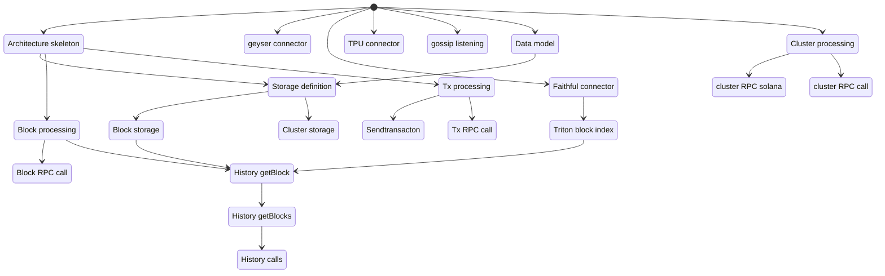

### Task definition

#### Tasks list

- Architecture skeleton: do the mimimun code to define the first version of the architecture implementation. (PhiD)
- geyser connector: Geyser (grpc) connector code to all geyser data. Data not available use the current RPC access.
    -> focus on leader schedule and make sendtransaction work without Solana RPC. 
    - vote account update to be defined. epoch info. always updated: lastVote, rootSlot, delinquent votes, epochCredits: 
        - recalculate the leader schedule using vote account activatedStake to see if it's the same. (PhilD)
        - Add new Vote account notification. See linus.
        - send all bank vote account (snapshot) at the subscription after send update. volume the number of validator (5000). They use cache inside grpc.
        - (do it later) epoch data that are missing. See new entry point. notification of epoch info.
        - implements.
    - get cluster info:
      - share memory, gossip, RPC (can keep basic endpoint on RPC): we've to define how we do.
- Faithful connector: connect to the Faithful service to query their method.
- Triton block index: research task on do we use the triton block index and how.
- TPU connector: manage TPU connection and connect to a specified validator's TPU port and send Tx batch. Done to be plug in the architecture.
- gossip listening: Listen to validator gossip and extract data. (leader schedule)
- Data model: define the stored data model + indexes for block and Cluster.
- Storage definition: implement the storage infra to host block and cluster data query.
- Block storage: implement block storage with epoch switch
- Cluster storage: implement cluster storage with epoch switch
- Block processing: implement block processing management. Base task:
    - Update block: update block process
    - get block: get block from cache and storage.
    - get current data: get block current data
- Block RPC call: implements block RPC call.
- Tx processing: implement Tx processing algo
    - notify Tx: notify Tx to other modules
    - update Tx cache
- Sendtransacton
    - send Tx
    - confirm Tx
    - replay Tx
- Tx RPC call: get Tx + Status
- History getBlock: integrate block index or/and call Faithful service
- History getBlocks: query indexes or add Faithful service call.
        - define if we use Triton blocks index or ask Triton to implement getBlocks.
- History other calls: implements the other history call.
- Cluster processing: cluster data processing implementation.
    - cluster data
    - cluster epoch update
    - cluster info
    - cluster epoch notification
- Cluster RPC solana
- Cluster RPC call

Block and slot notification at process:
 * slot on process notification.
 * Tx signature on process (Tx verification and execution are done.)
 * shred: block constructed.

Slot notification at the same commitment.
Tx signature subscription: shred, process, confirm, finalized. (slot, sign, commitment)

1) subscription to send process Tx signature. Try to deplucate (optimisation).
2) subscription process Tx in a block that contains only the Tx signature.

Validator -> share memory -> cluster -> web access to get them

Validator -> cluster -> geiser plug -> grpc access to get them

 Look at the message between geyser and validator.

Short term task.
- Architecture skeleton: do the minimum code to define the first version of the architecture implementation. (PhiD) 3d
- Leader schedule
  - recalculate the leader schedule using vote account activatedStake to see if it's the same. (PhilD) 2d
  - Solana discussion about how to get vote account, Tx at process, cluster info and epoch info that we need
- Slot subscription at process : does the gprc support it? (Stephan)
- Tx signature subscription: (shred), process, confirm, finalized. (slot, sign, commitment) (Stephan) see if it's only a grpc update.
- Faithful connector: connect to the Faithful service to query their method: getBlock. Test getBlock on different epoch. See timing. (Aniket)
- Triton block index: research task on do we use the triton block index and how.: getBlocks
- Data model: define the stored data model + indexes for block and Cluster.
