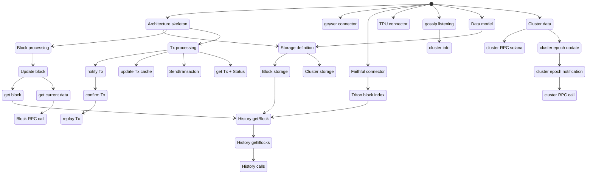

## Task definition

```mermaid
stateDiagram
    a1: Architecture skeleton
    c1: geyser connector
    c2: Faithful connector
    c22: Triton block index
    c3: TPU connector
    c4: gossip listening
    s1: Data model
    s2: Storage definition
    s3: Block storage
    s4: Cluster storage
    b1: Block processing
    b2: Update block
    b3: get block
    b4: get current data
    b5: Block RPC call
    t1: Tx processing
    t2: notify Tx
    t22: update Tx cache
    t3: Sendtransacton
    t333: replay Tx
    t33: confirm Tx
    t4: get Tx + Status
    h1: History getBlock
    h2: History getBlocks
    h3: History calls
    cl1: Cluster data
    cl2: cluster RPC solana
    cl3: cluster epoch update
    cl4: cluster info
    cl5: cluster epoch notification
    cl6: cluster RPC call

    
    [*] --> a1
    [*] --> c1
    [*] --> c2
    c2 --> c22
    [*] --> c3
    [*] --> c4
    [*] --> s1
    [*] --> cl1
    s1 --> s2
    s2 --> s3
    s2 --> s4
    a1 --> s2
    a1 --> b1
    b1 --> b2
    b2 --> b3
    b2 --> b4
    b4 --> b5
    a1 --> t1
    t1 --> t2
    t1 --> t22
    t1 --> t3
    t1 --> t4
    t2 --> t33
    t33 --> t333
    cl1 --> cl2
    cl1 --> cl3
    c4 --> cl4
    cl3 --> cl5
    cl5 --> cl6
    s3 --> h1
    c22 --> h1
    b3 --> h1
    h1 --> h2
    h2 --> h3
```
